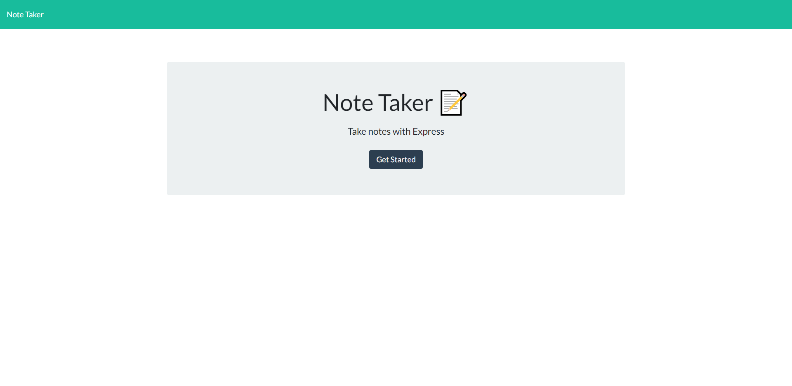

# Note-Taker
## Project Description
    An application called Note Taker that can be used to write and save notes.
    This application will use an Express.js back end and will save and retrieve note data from a JSON file.
 The landing page looks llike below
 <!--  -->
 

 ## Technologies Used
  HTML
 JavaScript
 Bootstrap
 Node.js
 Express.js

 ## Workflow of the app
 ```
GIVEN a note-taking application
WHEN I open the Note Taker
THEN I am presented with a landing page with a link to a notes page
WHEN I click on the link to the notes page
THEN I am presented with a page with existing notes listed in the left-hand column, plus empty fields 
   to enter a new note title and the note’s text in the right-hand column
WHEN I enter a new note title and the note’s text
THEN a Save icon appears in the navigation at the top of the page
WHEN I click on the Save icon
THEN the new note I have entered is saved and appears in the left-hand column with the other existing notes
WHEN I click on an existing note in the list in the left-hand column
THEN that note appears in the right-hand column
WHEN I click on the Write icon in the navigation at the top of the page
THEN I am presented with empty fields to enter a new note title and the note’s text in the right-hand column
```

## Installation & Usage

1. Clone this repository to use this application on local machine.
2. To install dependencies,run the below command 
      npm i
3. Add gitignore file to your project and specify node_modules in the gitignore file.

4. To run the application type node server.js. This will start localhost server.

## Heroku link
 The application is deployed in heroku. Click on the <a href="https://lit-fjord-19799.herokuapp.com/">link </a> to see application in live!
## Credits
google


